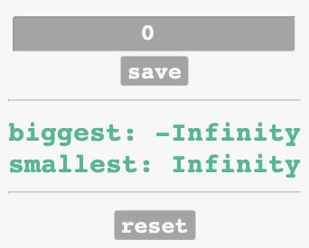

# Biggest and Smallest 
Here's and exercise for JavaScript starter students, for practice Javascript coding and lear step by step how to build and save the data model, and a exercises for learning how to create the init, data, listeners and handlers, load and logging. 

## Table of contents
* [General info](#general-info)
* [Screenshots](#screenshots)
* [Technologies](#technologies)
* [Setup](#setup)
* [Features](#features)
* [Status](#status)
* [Inspiration](#inspiration)
* [Contact](#contact)

## General info
As a student of Hack your future, I have to continue to practice exercises to be able to write the code in Javascript and create awesome web pages.

## Screenshots

## Technologies
* Javascript
* HTML/CSS
* GIT

## Setup
You can clone or fork this repository and test the files.

## Features
List of features ready and TODOs for future development
* Save button functionality
* Reset button functionality

## Status
Project is: finished, final version.

## Inspiration
[this repository](https://github.com/HackYourFutureBelgium/biggest-and-smallest)

## Contact
Created by [@Elisa0045](https://github.com/Elisa0045) - feel free to contact me!